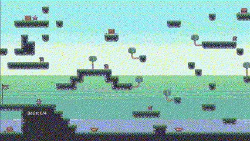

## Desafio Técnico GTI - Meu Jogo

Aceitei o desafio técnico do GTI e desenvolvi um jogo simples chamado **Pegue o Tesouro**, usando a **Godot Engine 4.4.1**! 🚀  

Neste jogo de plataforma 2D, o objetivo é coletar **todos os baús** enquanto supera obstáculos e desafios.

OBS: Para concluir a fase, passe pela bandeira após coletar os baús

Aqui está um exemplo de como ficou: 

Confira o repositório do desafio [aqui](https://github.com/gtismedev/desafio-tecnico).
